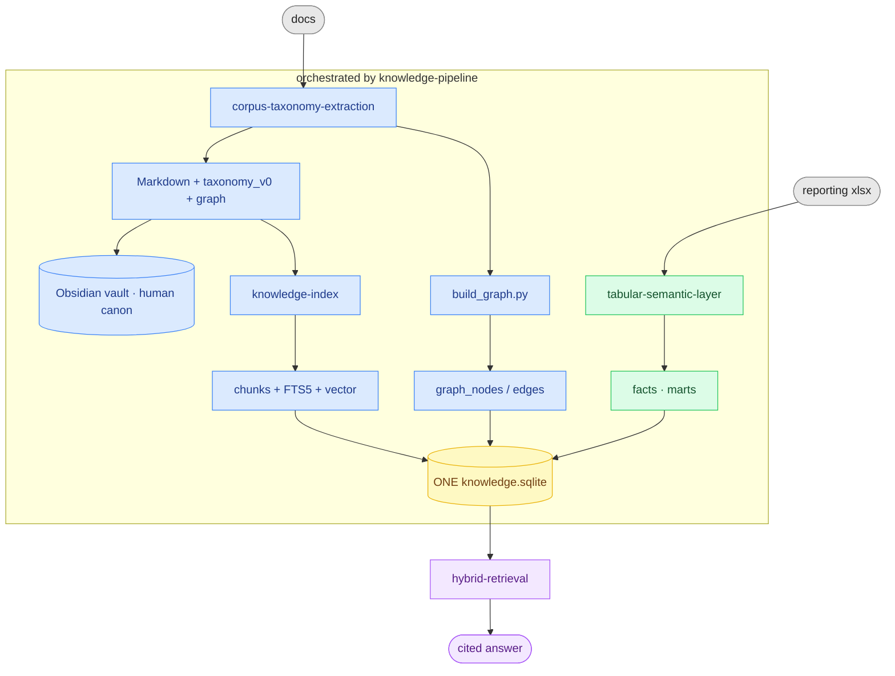

# Applied AI — the Brain 🧠

A distributable collection of **generic, corpus-agnostic** agent skills for building and querying a **Brain**: a local, truthful knowledge engine over your documents *and* spreadsheets. Each skill is self-contained code + docs; **no project-specific data, paths, or credentials live here** — those stay in the consuming project.

> **The one rule everything obeys:**
> **Meaning is agentic. Numbers are computed.**
> RAG and the taxonomy graph explain *what things mean and how they relate* — they never assert a figure. The deterministic marts compute *every number* from source tables — they never guess. Every answer is either **cited** or an honest **"not modeled."** Gaps beat fabrication.

Everything lands in **one portable `knowledge.sqlite`** (no server) — narrative chunks (FTS5 + vector), numeric marts, and the taxonomy graph — with an **Obsidian vault** as the human-readable canon.

---

## Start here: build a Brain, or use one?

This repo is the **`applied-ai`** marketplace with exactly two plugins. Pick by what you're doing:

| You want to… | Use | Surface | Start |
|---|---|---|---|
| **Build / maintain / deploy** a Brain from a corpus | **`brain`** (`/brain:*`) | Claude Code (CLI) | [Build a Brain](#build-a-brain-brain--claude-code) |
| **Query & co-author** with an existing Brain | **`kb`** (`/kb:*`) | Claude Code **and** Claude Cowork | [Use a Brain in Claude Code](#use-a-brain-in-claude-code-kb) · [in Cowork](#use-a-brain-in-claude-cowork-kb) |

`brain` is the heavy, interactive build side — it runs in **Claude Code only** (it needs local scripts, a venv, and source credentials). `kb` is the lightweight librarian that consumes a Brain's MCP and works in **both Claude Code and Cowork**. Most consumers only need `kb`.

---

## Use a Brain in Claude Code (`kb`)

For analysts and knowledge workers querying a Brain from the CLI.

```bash
# 1. Install the kb plugin
claude plugin marketplace add onetest-ai/applied_skills
claude plugin install kb@applied-ai

# 2. Point kb at your Brain's MCP (guided)
#    In a Claude Code session:
/kb:connect          # detects a Brain, or walks you through registering one
                     # (adds the mcpServers block from `./brain mcp-config` to .mcp.json)

# 3. Ask
/kb:ask   What was Q3 churn by region, and what's driving it?
```

Every answer is **cited** (to a mart row, document, or graph node) or honestly **"not modeled."** Numbers come only from the marts.

**The seven skills:** `/kb:ask`, `/kb:explore`, `/kb:challenge` (interrogate) · `/kb:brief`, `/kb:report` (cited Markdown, human-gated writes) · `/kb:mode` (opt-in ambient grounding) · `/kb:connect`. See [`bundles/kb/README.md`](bundles/kb/README.md).

---

## Use a Brain in Claude Cowork (`kb`)

For the same querying, inside Claude Desktop's Cowork. Cowork keeps its own plugin state and connects to MCP servers **from Anthropic's cloud** (not your machine), so setup differs from the CLI: install the plugin into Cowork, and register the Brain as a **remote connector**.

1. **Install kb into Cowork** — *Customize → Plugins → Add marketplace*, enter the `applied-ai` GitHub URL (`onetest-ai/applied_skills`), install **kb**, enable it. (Air-gapped alternative: upload a ZIP of `bundles/kb`, ≤50 MB.)
2. **Add your Brain as a connector** — *Customize → Connectors → Add custom connector*. Paste your project's **HTTPS MCP URL**, authorize with **Entra OAuth** (or set an `X-API-Key` header). The connector's name is yours to choose — kb finds a Brain by the tools it exposes, not by what the connector is called.
3. **Verify** — run `/kb:connect`, then `/kb:ask`, `/kb:explore`, `/kb:report`, …

Each project has its own Brain endpoint; if you're in two projects, add both connectors and leave both enabled — kb discovers every reachable Brain and asks which to use when more than one answers, and you can name one in the request ("ask the acme brain about …"). **Cowork caveats:** ambient mode (`/kb:mode`) and the SessionStart health line rely on hooks, which don't fire in Cowork — ground answers by invoking the kb skills explicitly. Full walkthrough: [`bundles/kb/docs/cowork-setup.md`](bundles/kb/docs/cowork-setup.md).

---

## Build a Brain (`brain` · Claude Code)

For the person who turns a messy corpus (PDF/PPTX/DOCX/XLSX/MD) into a queryable Brain.

**Meaning is agentic (RAG/graph); numbers are computed (deterministic SQL).** RAG never produces figures; the mart lane never guesses.



<sub>**Blue** = meaning (agentic RAG/graph) · **green** = numbers (computed marts) · **yellow** = the one portable store · **purple** = the cited answer.</sub>

Retrieval is **hybrid**: BM25 (FTS5) + vector (sqlite-vec) fused by **Reciprocal Rank Fusion** — pattern from [arozumenko/wikis](https://github.com/arozumenko/wikis). One file, moves anywhere. The whole toolkit is **torch-free** (the RAG embedder is fastembed/onnx; docling is retired) — see [Dependencies](#dependencies).

```bash
claude plugin marketplace add onetest-ai/applied_skills
claude plugin install brain@applied-ai      # the 8 Brain skills (/brain:*)
# then, in a Claude Code session, run the guided build:
/brain:knowledge-pipeline                    # captures goal · audience · deployment target, then builds
```

Guided onboarding captures three drivers up front — the **goal** (scopes taxonomy), the **audience** (who consumes the KB — drives taxonomy emphasis and how `kb` answers), and the **deployment target** (`local` vs `hosted-mcp`). Full flow: [`bundles/brain/README.md`](bundles/brain/README.md); the build agent's exact runbook: [`bundles/brain/AGENT_README.md`](bundles/brain/AGENT_README.md).

### The build/answer skills

| Skill | Role | Key idea |
|---|---|---|
| **corpus-taxonomy-extraction** | build | Goal-directed taxonomy induction (intent classes + entities + metric inventory) from a mixed corpus (PDF/PPTX/DOCX/XLSX via pymupdf + LibreOffice; MD/TXT pass through). Also emits the taxonomy **graph** (`build_graph.py`) and an **Obsidian vault** (`to_obsidian.py`), and flags near-duplicate / off-axis categories for human review. |
| **visual-parse** | build | Page routing + visual understanding: renders slide/diagram pages, flags the visual ones, and VLM-transcribes them (with deterministic table-grid extraction) so meaning on slides isn't lost. |
| **knowledge-index** | build | Local hybrid RAG over Markdown → SQLite **FTS5 + sqlite-vec, RRF-fused**. Torch-free embeddings (fastembed/onnx). The narrative lane. |
| **tabular-semantic-layer** | build | Config-driven ETL of large/heterogeneous Excel → normalized `facts` in the same SQLite + a governed metric catalog. Four layouts, weighted rollups, build audit (`--strict`). |
| **hybrid-retrieval** | answer | Routes each sub-question — numbers→marts SQL, narrative→RRF RAG, relations→graph JOINs — over the one SQLite; reconciles `both`; composes one cited answer. |
| **knowledge-pipeline** | orchestrate | Create the store (index+marts+graph) and answer, with guided onboarding (goal · audience · deployment target) and source registration. |
| **brain-maintenance** | maintain/release | Read-only maintenance planning plus agent-owned, gated updates, verification, and optional external project-adapter deployment. |
| **obsidian-vault** | navigate | Browse/answer from the generated Obsidian vault — the human-readable view of the store (numbers still come from the MCP, never vault prose). |

---

## Why this exists

Vector RAG cannot return correct numbers; raw text-to-SQL returns *confident wrong* numbers. A governed semantic layer over deterministic SQL benchmarks far higher and fails by honest refusal. These skills implement that split, plus the operational guardrails (provenance, entity conformance, silent-gap auditing) that make it hold up in production.

## Install options

The Claude plugin install (above) is the shortest path. The skills also install directly into any host that reads the standard `SKILL.md` format — a copy or symlink, no translation.

**Targets**

| Host | Project dir | User dir (`--user`) |
|---|---|---|
| `claude` | `.claude/skills/` | `~/.claude/skills/` |
| `dsh` (DeepSeek Harness) | `.dsh/skills/` | `~/.dsh/skills/` |
| `copilot` (GitHub Copilot) | `.github/skills/` | `~/.copilot/skills/` |
| `codex` | `.codex/skills/` | `~/.codex/skills/` |

**Bundles (curated sets)** — install a whole toolchain in one shot:

```bash
npx github:onetest-ai/applied_skills init --bundle brain              # the 8 Brain skills
./install.sh --bundle brain                                           # same, from a checkout
```

**npx one-liner (no clone):**

```bash
npx github:onetest-ai/applied_skills init                      # all skills → all 4 hosts (this project)
npx github:onetest-ai/applied_skills init --target claude,dsh  # pick hosts
npx github:onetest-ai/applied_skills init --user               # install under $HOME
npx github:onetest-ai/applied_skills init --symlink            # link instead of copy
npx github:onetest-ai/applied_skills init --dry-run            # preview
```
(Private repo → needs git access, e.g. `npx git+ssh://git@github.com/onetest-ai/applied_skills.git init`.)

**Shell installer (no Node):**

```bash
git clone git@github.com:onetest-ai/applied_skills.git && cd applied_skills
./install.sh --target all            # or claude|dsh|copilot|codex
./install.sh --target codex --user   # → ~/.codex/skills
./install.sh --symlink --dry-run
```

**Claude plugin (marketplace):**

```bash
claude plugin marketplace add onetest-ai/applied_skills
claude plugin install brain@applied-ai   # Build/maintain/deploy the Brain (/brain:*)
claude plugin install kb@applied-ai       # Interrogate/author (/kb:*)
```

Restart the host session after installing so it loads the skills. Don't combine the plugin and the copy/symlink install — pick one, or the skills load twice. Corpus-specific configuration (source roots, family definitions, metric catalogs, taxonomy, deployment profiles) belongs in the **consuming project's** repo, not here; each skill's example templates show the shape to copy. See [`bundles/SPEC.md`](bundles/SPEC.md) for the bundle format.

## Dependencies

Python 3.10+, stdlib `sqlite3` (with `enable_load_extension`). Per-skill: `pymupdf` (PDF text + page render + table extraction); `sqlite-vec`, `fastembed` (knowledge-index RAG); `openpyxl`, `pandas`, optional `pyarrow` (tabular); `fastmcp` + `uvicorn` (Brain MCP stdio/HTTP). All are pip-installable and **torch-free** (docling retired). `.pptx/.docx` also need LibreOffice `soffice` (a system dep); PDFs need only pymupdf.

Install them into an **isolated venv that belongs to the skills, not your project** — `install.sh --bundle brain --deps` (uses `uv`) builds `<project>/.claude/venv`. Add `--user` to build **one shared** `~/.claude/venv` (or `~/.dsh/venv`) reused across all projects instead of a venv per project. Zero-install alternative: `uv run --with-requirements bundles/brain/requirements.txt python <script>`. The store remains local and portable; the optional Brain MCP HTTP transport is disabled by default.
