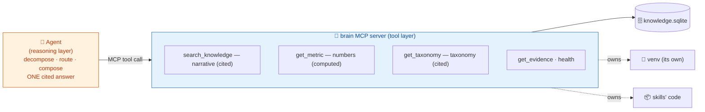
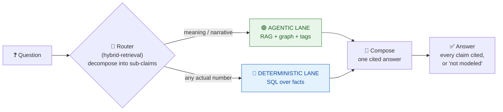
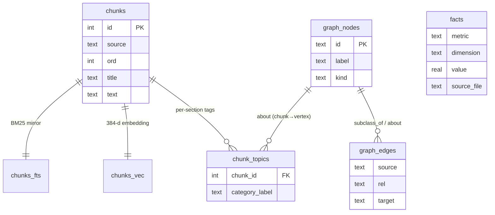
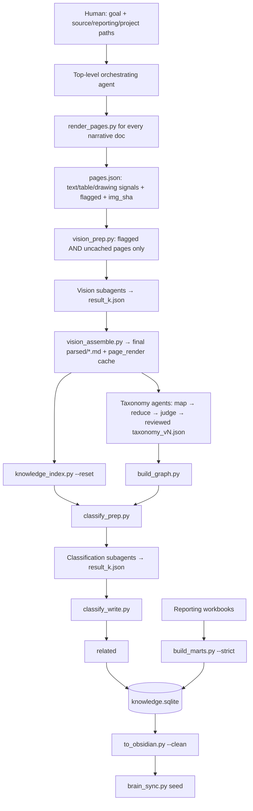
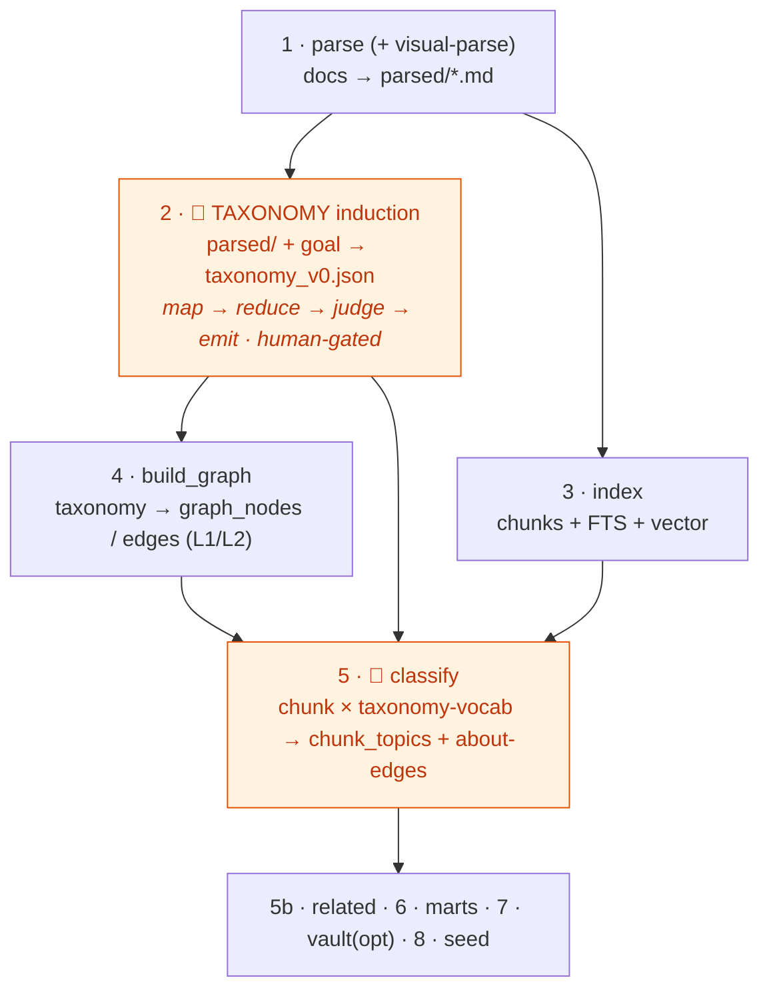
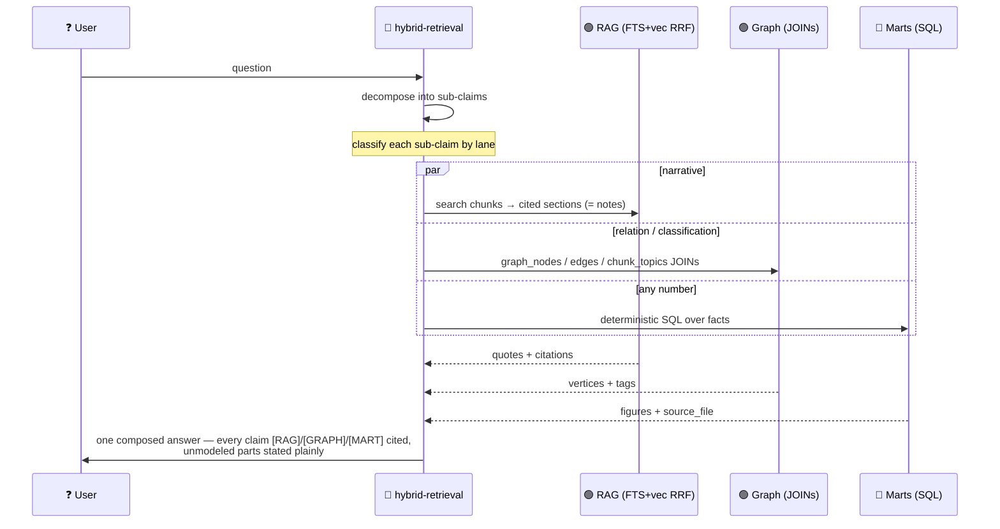

# 🧠 Brain — a local, truthful knowledge engine

**One portable `knowledge.sqlite` + an Obsidian vault over a messy corpus of documents *and* spreadsheets.**
No required cloud service and no lock-in. Copy `knowledge.sqlite` for text/graph/numeric querying; copy the project’s `assets/` as well when page images and extracted table evidence must remain available. Expose the store through local stdio or explicitly enabled HTTP.

> **The one rule everything obeys:**
> **Meaning is agentic. Numbers are computed.**
> RAG and the graph explain *what things mean and how they relate*; they never assert a figure.
> The marts compute *every number* deterministically from source tables; they never guess.
> Every answer is either **cited** or an honest **"not modeled."** Gaps beat fabrication.

---

## What's in the bundle

`brain` collects eight skills and all their scripts into one installable set:

| Skill | Role | Ships |
|---|---|---|
| **knowledge-pipeline** | 🎛️ build orchestrator — create and answer | `SKILL.md` (build & answer sequence) |
| **brain-maintenance** | 🔄 update/release planner — read-only status plus agent-gated update and external deployment guidance | `maintenance.py`, profile template, safety gates |
| **corpus-taxonomy-extraction** | 🏷️ meaning: parse, induce taxonomy, build graph, tag sections, emit vault | `parse_corpus.py`, `consolidate.py`, `emit_taxonomy.py`, `chunking.py`, `build_graph.py`, `classify_prep.py`, `classify_write.py`, `to_obsidian.py` |
| **knowledge-index** | 🔎 narrative: heading-aware chunks → FTS5 + vectors | `knowledge_index.py`, `chunking.py` (shared) |
| **tabular-semantic-layer** | 🔢 numbers: Excel → deterministic `facts` | `build_marts.py`, `profile_workbooks.py`, `families.example.json`, `metrics.example.json` |
| **hybrid-retrieval** | 🧭 answer: route each sub-claim to the right lane, fuse, cite | `query.py` |
| **visual-parse** | 👁️ page routing + visual understanding | `render_pages.py`, `vision_prep.py`, `vision_assemble.py` |
| **obsidian-vault** | 🗂️ navigate the generated human-readable view | `SKILL.md` |

Plus the repo's top-level **`mcp/brain/`** — the governed FastMCP **tool layer** (`fastmcp_server.py`) with local stdio and opt-in Streamable HTTP. It lives in `mcp/`, not `skills/` (see below).

---

## Install

```bash
# the whole brain, into every host you use (claude / dsh / copilot / codex)
npx github:onetest-ai/applied_skills init --bundle brain

# or with the shell installer from a checkout
./install.sh --bundle brain

# scope to one host and symlink for live edits
npx github:onetest-ai/applied_skills init --bundle brain --target claude --symlink
```

The installer reads `bundles/brain/factory.json`, resolves the ordered skill list, and copies (or symlinks) each into the host's native `skills/` dir. All hosts read the same `SKILL.md` format — no translation.

---

## Getting started — guided onboarding

Don't hand-run the pipeline on your first brain. Ask the orchestrator to **create a brain** / **get started** and it runs a wizard: it asks for your **goal** (the single analytical goal that scopes everything), your **docs** folder, your **reporting spreadsheets** (if any), and a **project dir** — then scaffolds the layout, drops in config templates, preflights the deps, scans your corpus into narrative-vs-reporting, and writes a `BRAIN.md` with the exact ordered build commands. It walks you through the build, pausing at the agentic stages (visual transcription when needed, taxonomy induction, and chunk classification), verifies every lane, and answers your first question.

```bash
# the deterministic core of the wizard (the orchestrator drives the questions):
python .../knowledge-pipeline/onboard.py scaffold --project ./acme-brain \
  --goal "optimize call-center ops and introduce an AI workforce" \
  --docs ./docs --reporting ./xlsx \
  --docs-mode import --reporting-mode import   # use mirror only for authoritative folders
python .../knowledge-pipeline/onboard.py verify --db ./acme-brain/schema/knowledge.sqlite
```

See **knowledge-pipeline → Guided onboarding** for the full flow.

## The tool layer: an MCP server (who does what)

The brain is served to an agent through the **`brain` MCP server** — a FastMCP server
using local stdio by default and opt-in Streamable HTTP for remote clients. It hides the
scripts behind governed tools and draws a hard line between the two jobs:



- The **server owns the venv + skills + store** and returns cited text / computed numbers — it **never reasons**. The truthfulness rule lives right here: `get_metric` returns governed figures with `source_file`; `search_knowledge`/`get_taxonomy` return cited text, never an authoritative number.
- The **agent never runs Python or guesses a path** — it calls tools. Because the server is registered with the venv's interpreter, "where do I run?" simply doesn't arise.

The server lives at the repo's top-level **`mcp/brain/`** (installed to `<host>/mcp/brain/`, a sibling of `<host>/skills/`). Register it during install (writes a local stdio configuration using `fastmcp_server.py`):

```bash
./install.sh --bundle brain --deps --mcp          # copy skills, build venv, register the server
./brain mcp-config                                # or print the JSON block for another host
```

Tools: `list_metrics` · `get_metric` · `search_knowledge` · `get_taxonomy` · `find_related_content` · `get_evidence` · `health`. HTTP is opt-in and binds to `0.0.0.0` by default for container/orchestrator reachability. Set `BRAIN_API_KEY` to require `X-API-Key` on `/mcp` (`/healthz` stays public for probes); production exposure still requires TLS, authorization, key rotation, rate limits, and auditing. The public schemas declare concrete primitive types (and `null` for optional parameters) while `SkipValidation` preserves fail-safe runtime validation; this avoids schema-converting clients silently dropping arguments without turning malformed calls into opaque protocol failures.

**Building the answering agent on top?** See [`BUILDING-AGENTS.md`](BUILDING-AGENTS.md) — what to put in *your* agent's role instructions so it disambiguates scope/grain/population, surfaces caveats, and answers truthfully (this is agent-design guidance, separate from a deployment's own `AGENTS.md`).

## The core idea: two lanes, one truth

Most "chat with your docs" tools blur narrative and numbers into one embedding soup, then let the model *narrate a number*. That is exactly where they lie. Brain keeps the two apart by **what makes each trustworthy**, and only rejoins them at answer time.



- 🟢 **Agentic lane** — narrative retrieval (BM25 + vectors, fused), a taxonomy graph, and per-section tags. Answers *what things mean and how they relate*. **Never emits a figure.**
- 🔵 **Deterministic lane** — SQL over the `facts` table, each row tracing to a source workbook. Answers *every actual number*. **Never guesses.**

---

## One store, three lanes, one file

Everything lands in a single `knowledge.sqlite`. A **chunk = a section = an Obsidian note = a retrieval unit = a graph-linked entity** — one identity across all lanes, so retrieval hits, tags, graph vertices, and human-readable notes all reference the same ids.



| Lane | Tables | Built by | Answers |
|---|---|---|---|
| 🟢 narrative (RAG) | `chunks`, `chunks_fts`, `chunks_vec` | knowledge-index | "what does the corpus say about…" |
| 🟢 taxonomy graph | `graph_nodes`, `graph_edges`, `chunk_topics` | corpus-taxonomy-extraction | "how do these relate / classify" |
| 🔵 numbers | `facts` (+ governed `metrics.<corpus>.json`) | tabular-semantic-layer | "what is the value / trend / comparison" |

The **Obsidian vault** is a *view* of this same store: one note per chunk, real per-section tags from `chunk_topics`, and `[[topic]]` links that are 1:1 with the graph vertices. So a human browsing the vault sees exactly what retrieval sees.

---

## Creating and updating a brain

There are two actors:

- **Human/operator:** supplies the goal and paths, approves taxonomy changes, reviews plans and failures, and starts or resumes the build agent.
- **Orchestrating agent:** runs deterministic scripts in the consuming brain project, launches cheap vision/text subagents for judgment steps, validates their JSON outputs, then continues the pipeline. The subagents do not run by themselves and the MCP answering server does not build the brain.

In other words, “agentic” does not mean an invisible daemon. A human asks an agent in Claude Code, dsh, Codex, or another capable host to create/update the brain. That top-level agent reads `knowledge-pipeline` and `visual-parse`, executes commands in the **brain project**, and dispatches subagents from that same session. See [`AGENT_README.md`](AGENT_README.md) for its exact runbook, contracts, checkpoints, and failure rules.

### Project artifacts and ownership

```text
<brain-project>/
  goal.txt
  schema/                         # families/metrics config + usually knowledge.sqlite
  taxonomy/taxonomy_vN.json       # reviewed vocabulary; source of truth
  parsed/                         # final, VLM-enriched Markdown consumed by brain_sync
  assets/<doc-slug>/
    pages.json                    # page routing decision + img_sha
    pNN.png                       # rendered factual evidence
    pNN.txt                       # verbatim text layer
    pNN.tables.md                 # deterministic table grids, when found
  vision/                         # transient batch_*.json + agent result_*.json
  classify/                       # transient batch_*.json + agent result_*.json
  marts/                          # deterministic audits/intermediates
  vault/                          # disposable human view
  sync_plan.json                  # update work order
```

`knowledge.sqlite` owns two important caches/provenance tables:

- `page_render(img_sha, …, md)` caches VLM transcription by rendered-page hash.
- `documents(doc_id, sha, …)` records the hash of each **final parsed Markdown document** for indexing delta detection.

These are separate deltas: page hashes avoid repeated VLM work; parsed-document hashes avoid repeated embedding and classification.

### Full creation flow



Ordering matters:

1. **Render first.** `render_pages.py` converts Office files through LibreOffice, renders every page, extracts text and table grids, and flags pages whose layout probably carries meaning.
2. **Transcribe before taxonomy, indexing, or classification.** `vision_prep.py` creates batches only for `flagged` pages whose `img_sha` is absent from `page_render`. The orchestrator launches vision-capable low-cost subagents; each writes one `result_k.json`. `vision_assemble.py` then combines VLM Markdown for visual pages with PyMuPDF text for ordinary pages and stores fresh VLM results in `page_render`.
3. **Induce taxonomy from final enriched Markdown.** This is agentic and human-gated. A pre-VLM taxonomy can miss concepts visible only in diagrams.
4. **Index once, after visual assembly.** Do not classify a provisional text-only index and then redo it; that creates a needless second classification pass.
5. **Classify after index + graph exist.** `classify_prep.py` creates batches; text agents assign exact L1/L2 labels; `classify_write.py` commits them.
6. Build `related`, deterministic marts, and the optional vault; verify; finally run `brain_sync.py seed` to establish the update baseline.

The generic text-only `parse_corpus.py` remains useful for corpora known not to need visual understanding. For slide decks, diagrams, timelines, or chart-heavy PDFs, the canonical path is **`render_pages → vision_prep → vision agents → vision_assemble`**, not `parse_corpus.py` alone.

### Full update flow

`./brain update <parsed>` starts at the **already assembled `parsed/` boundary**. It does not inspect source PDFs, render pages, or launch agents. A correct source-to-store update is therefore orchestrated as follows:

1. Human tells the top-level agent which source corpus and brain project to update.
2. Agent identifies added/changed/deleted source documents. Until a source-manifest command exists, use source paths plus SHA-256; do not rely only on mtime.
3. For each added/changed narrative document, run `render_pages.py` into its stable asset directory. **Prevent basename collisions:** the current renderer derives `<slug>` from basename only, so same-named files from different source folders must be rendered under separate asset roots or assigned collision-free names by the orchestrator. Remove stale asset/parsed outputs for deleted documents.
4. Use a **fresh run-specific `vision/` directory** (prep/consumer scripts do not clean stale files), then run `vision_prep.py --db "$DB"` across the changed render directories. Existing `page_render.img_sha` values are skipped automatically.
5. If batches exist, dispatch vision subagents and validate that every batch `img_sha` appears exactly once in `result_*.json`; the consumer scripts are intentionally permissive, so this validation is mandatory.
6. Run `vision_assemble.py --results <vision> --db "$DB"` for changed documents. This creates the final enriched Markdown and updates the page cache. For a cache-only run, `--db` can supply previous transcriptions even when no new results exist.
7. Run `brain_sync.py plan`; show the added/changed/deleted/unchanged summary to the human. It now opens an existing initialized store read-only. Then run `apply`, which snapshots SQLite, deletes removed documents, re-embeds only added/changed parsed docs, and writes `sync_plan.json`. Preserve the snapshot as operational recovery even though the database changes are committed as one transaction.
8. Run `classify_prep.py --chunks <sync_plan.reclassify_chunk_ids>`, dispatch text subagents, validate results, and run incremental `classify_write.py` **without `--reset`**.
9. Rebuild graph and related; rebuild marts only if reporting workbooks changed; regenerate the vault with `--clean`; run verify.
10. Keep the current taxonomy unless coverage indicates vocabulary drift. Taxonomy expansion is a separate additive, human-approved operation—never silently rename/remove existing nodes.

```text
source change
  → render changed docs
  → page img_sha cache
  → VLM only flagged + uncached pages
  → assemble changed parsed docs
  → parsed SHA delta
  → embed/tag only changed chunks
  → reconcile graph/related/marts/vault
```

### Portable mother sources and chat attachments

A Brain now uses a relocatable `brain.toml` to name source roots. SQLite never stores absolute source paths or original PDF/PPTX/XLSX bytes; it stores a source registry with stable `source_id`, `root_key`, normalized relative path, SHA-256, description, kind, and provenance.

```toml
version = 1

[sources.roots.incoming]
path = ".incoming"
mode = "managed"
include = ["**/*"]

[sources.roots.docs]
path = "../company-docs"
mode = "import"
include = ["**/*.pdf", "**/*.pptx", "**/*.docx"]
```

- `import`: scans matching files and proposes adds/content updates, but absence never implies deletion. Use a narrow root/include set when discovery must be limited; `source adopt` registers one explicit file.
- `mirror`: when the root is available, absence becomes a removal **candidate**, never an automatic delete.
- `managed`: Brain-owned files such as chat attachments copied into `.incoming`; missing files are reported as corruption.
- An unavailable root is always `root_unavailable`, not “all files deleted.”

For a chat attachment, the host materializes a temporary file and the operator/agent runs:

```bash
./brain source import /temporary/attachment.pdf --root incoming \
  --description "September CEC update" \
  --provenance '{"attachment_id":"…","conversation_id":"…"}'
```

The file is atomically copied to the managed relative root with a hash-prefixed collision-safe name and registered. The temporary chat path may then disappear. Source bytes remain on the filesystem, not in SQLite. `source plan/apply` updates metadata for safe add/content-change/move actions; removal requires explicit `source remove <id> --yes`. Only a tombstoned linked source allows `brain_sync` to delete missing parsed output. This makes `list/get/remove` possible without changing existing `chunks.source` identities.

### Human quick start

You do not need to run every command manually. From the brain project, ask a capable coding agent:

> Create (or update) this brain from `<docs>`, using the full visual pipeline. Follow the brain bundle’s `AGENT_README.md`. Show me the source and parsed delta before destructive changes; pause for taxonomy changes; verify all lanes at the end.

The agent should create a visible task list and checkpoints. You approve:

- the analytical goal and input paths;
- the initial taxonomy or an additive taxonomy diff;
- the `brain_sync plan`, especially deletions;
- any failed/partial VLM or classification batches;
- completion only after verification.

### Important current limitations

- There is not yet a single source-aware executable that wraps the entire flow. The **top-level agent is the orchestrator**.
- `brain_sync` compares final `parsed/*.md`, not original binaries.
- `parse_corpus.py` rewrites outputs and does not clean removed outputs automatically; for visual corpora prefer the explicit per-document flow above and reconcile deletions deliberately.
- `page_render` makes VLM incremental, but rendering changed source documents remains deterministic work.
- Agent batch directories are transient work products and must be fresh per run; stale `result_*.json` files are otherwise consumed. Keep a run directory until validation succeeds, then archive or remove it. The durable VLM cache is in SQLite.
- Extracted `pNN.tables.md` grids remain factual sidecars served by `get_evidence`; `vision_assemble.py` does not append them to parsed Markdown. Preserve `assets/` and use evidence retrieval for table figures.
- A rendered page is one top-level `##` section, but VLM subheadings can split it into multiple chunks/notes. The image marker is inherited across those sibling chunks.

---

## The taxonomy — when it's made, where it lives, and how it changes

The **taxonomy is the seed the whole store keys off**: the intent hierarchy (L1/L2) that becomes the graph vertices and the closed vocabulary the classifier tags sections against. Understanding *when* it's produced and *how it evolves* is the difference between a store that stays coherent and one whose tags rot.

### Where it sits in the pipeline
Taxonomy induction is the **first agentic step, right after parsing** — and everything relational depends on it:



- **`index` (3) does NOT depend on the taxonomy** — it can run in parallel; but **`build_graph` (4) and `classify` (5) do**: the graph *is* the taxonomy as vertices, and the classifier tags each chunk *against the taxonomy vocabulary*. So the taxonomy must exist before them.
- Induction reads the **document text** (`parsed/`), not the chunks/store.

### How it's made (`map → reduce → judge → emit`)
1. **map** — low-tier (Haiku) subagents, per document, extract candidate terms (intent classes, entities, metrics) each with an evidence quote, source, and confidence → one JSON per doc. The bulk context lives and dies inside each subagent.
2. **reduce** — `consolidate.py` deterministically clusters near-duplicates (stdlib difflib); a low-tier agent adjudicates **only the ambiguous** merges ("Chicago" vs "CHI").
3. **judge** — an LLM-as-judge scores coverage/coherence and flags low-confidence/unmapped terms.
4. **emit** — `taxonomy_v0.json` (+ `.md`): human-reviewable, **versioned**, with a *demoted* list.

The **goal string is a noise filter** — extraction is scoped to the analytical goal. Prefer **seed-guided over schema-free**: anchor on any existing taxonomy doc (a "Taxonomy Compendium") and extend it.

### Where it lives
`taxonomy_v0.json` is a **project artifact** — it lives in the consuming project (with `families.<corpus>.json`, the goal, the built store), **never in the store or the skills**. It is *loaded into* the store as `graph_nodes` by `build_graph`, but the source-of-truth JSON stays a file so it can be reviewed, versioned, and hand-edited.

### How the visual/VLM parse affects it
The parse stack now transcribes visual pages (flows, timelines, diagrams) via `visual-parse` instead of dropping them to fragments. Since induction reads `parsed/`, **its input is now richer** — concepts that previously lived only on slides ("North Star Vision & Service Design Blueprint", phase/framework/capability names) become visible to the map step, so a freshly-induced taxonomy covers **more**. Consequence:

- A **from-scratch build** captures visual concepts automatically (induction reads the VLM-enriched `parsed/`).
- An **existing brain whose taxonomy predates the visual parse under-covers** those concepts — visible as visual-page chunks that classify leaves **untagged** (no matching L1). That's the signal it's time to refresh the taxonomy.

### How it behaves during an update (the key rule)
The pipeline deliberately separates **two different deltas**:

| What changes | Mechanism | Automatic? |
|---|---|---|
| **Content** (docs added/changed/deleted) | top-level agent runs source visual preparation, then `brain_sync` diffs final parsed Markdown → re-embed + reclassify only the delta | ⚙️ agent-orchestrated; `./brain update` covers parsed→store only |
| **Vocabulary** (the taxonomy itself) | re-induce + **additive** merge | ❌ deliberate, human-gated |

During the complete agent-orchestrated update, `./brain update` is the parsed→store apply step: the taxonomy is **reused as-is**, after which the top-level agent reclassifies only chunk IDs listed in `sync_plan.json`. A genuinely new concept does **not** get a new L1 until someone proposes and approves an additive taxonomy extension.

**Why vocabulary change is gated and additive:** chunk ids are deterministic from source path + section ordinal, while graph node ids are `slug(label)`. **Adding** L1/L2 is safe (`build_graph` rebuilds `subclass_of` and preserves valid `about` edges). But **renaming or removing** a category changes/removes its node id; `build_graph` then prunes that node and deletes its dependent `chunk_topics` and `about` edges. That is destructive classification loss, so taxonomy evolution during updates is **add-only, never rename/remove**, and passes a human gate.

### Refreshing the taxonomy — **assisted** (agent proposes, human gates), additive only
When the signal appears (a rising share of **untagged** chunks), grow the taxonomy without breaking anything:
1. **`taxonomy_refine_prep.py`** — gather the UNTAGGED chunks + the current L1/L2 vocab, batch them.
2. **(low-tier agents)** — propose additions: a new **L2 under a named parent L1** (preferred) or a new **L1**, with evidence → `result_k.json`. (Or map a chunk the classifier missed to an existing category.)
3. **`taxonomy_merge.py`** — dedups (exact + fuzzy) against the existing vocab, attaches each L2 to its parent, and **prints a diff DRY-RUN by default — the human gate**; `--apply` writes the version-bumped taxonomy (**add-only**, with history; never rename/remove).
4. **Deterministic downstream** — `build_graph` (adds the new vertices, preserves `about` edges) → reclassify the affected chunks (`classify_prep --docs/--chunks` → agents → `classify_write`) → refresh `related` and (optionally) the vault.

**Classification is L1 + L2:** the classifier assigns the *most specific* fit (an L2 when the chunk is specifically about it, else its L1), and an L2 **rolls up its parent L1** automatically — so both granularities are queryable and L1 filters still catch L2-tagged chunks.

---

## Answer pipeline (per question)



**Retrieval fusion (the RAG lane):** BM25 (SQLite FTS5) and vector similarity (sqlite-vec, `bge-small-en-v1.5`, 384-d) are run independently and merged by **Reciprocal Rank Fusion** (`k=60`, weights FTS `0.4` / VEC `0.6`, pool `30`) — the pattern borrowed from the `wikis` retriever. Numbers never come from here; they come from `facts`.

---

## Why local SQLite + Obsidian (and not a server)

- **Portable** — one file. Moves to `.dsh` / Claude / Copilot / Codex / CI with a copy; no service to stand up, no auth to manage.
- **Hybrid search is ours** — FTS5 + sqlite-vec + RRF need no external engine.
- **Taxonomy & node-sets live fine in the graph tables + the vault** — a UI/server was more friction than value for a portable toolkit.
- **RAG lives in the same SQLite** as the numbers and the graph, so one identity ties chunk ↔ note ↔ tag ↔ vertex.
- **No external knowledge backend** — retrieval, taxonomy, evidence, and governed metrics stay in the local store; the Obsidian vault provides the browsable graph view.

---

## Dependencies & the skills' venv

Python ≥ 3.9, all pip-installable: `sqlite-vec`, `fastembed`, `pymupdf`, `openpyxl`, `pandas`, `pyarrow` (`sqlite3` is stdlib). **Torch-free** (docling retired) — the installed set is small (~200 MB, mostly onnxruntime). `.pptx/.docx` also need LibreOffice `soffice` (a system dep); PDFs need only pymupdf.

These deps live in a venv that **belongs to the skills, not your project** — kept separate so they never mix with your project's own Python env. The installer (via `uv`) builds it next to the skills inside the host dir:

```bash
./install.sh --bundle brain --deps          # per-project:  <project>/.claude/venv
./install.sh --bundle brain --deps --user   # SHARED:       ~/.claude/venv  (or ~/.dsh/venv)
```

Use `--user` to build **one shared venv reused by every project** instead of a venv per project. The generated `BRAIN.md` and scripts then run under that interpreter (`BRAIN_PY`). Zero-install alternative (no venv, uv caches the deps): `uv run --with-requirements requirements.txt python <script>`.

The low-tier map/classify steps assume a subagent mechanism with a model override (e.g. Haiku); on another harness, substitute any cheap model that can read a file and emit JSON.

## Generic vs project-specific

The bundle ships **only generic code**. Everything corpus-specific — `families.<corpus>.json`, `metrics.<corpus>.json`, the goal string, `taxonomy_v0.json`, and the built `knowledge.sqlite` — stays in the consuming project, never in the skills.
