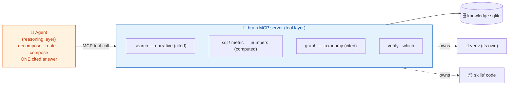
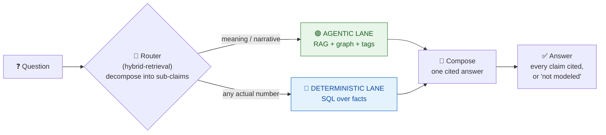
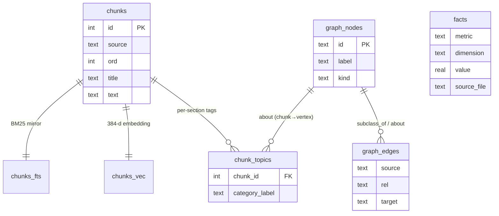
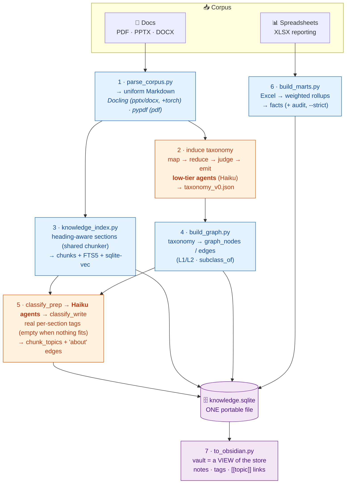
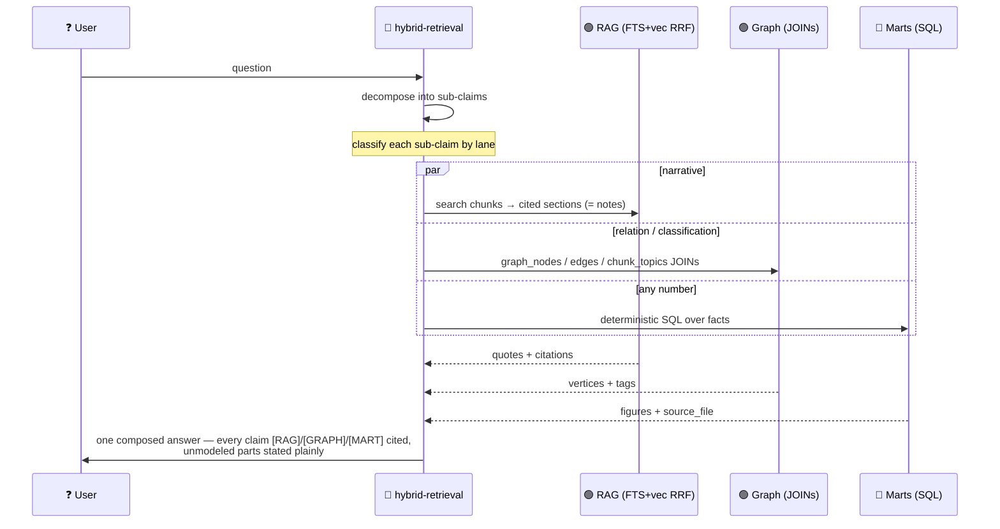

# 🧠 Brain — a local, truthful knowledge engine

**One portable `knowledge.sqlite` + an Obsidian vault over a messy corpus of documents *and* spreadsheets.**
No server, no cloud, no lock-in. Copy one file and the whole brain moves with it.

> **The one rule everything obeys:**
> **Meaning is agentic. Numbers are computed.**
> RAG and the graph explain *what things mean and how they relate*; they never assert a figure.
> The marts compute *every number* deterministically from source tables; they never guess.
> Every answer is either **cited** or an honest **"not modeled."** Gaps beat fabrication.

---

## What's in the bundle

`brain` collects five skills (+ one optional) and all their scripts into one installable set:

| Skill | Role | Ships |
|---|---|---|
| **knowledge-pipeline** | 🎛️ orchestrator — the entrypoint | `SKILL.md` (build & answer sequence) |
| **corpus-taxonomy-extraction** | 🏷️ meaning: parse, induce taxonomy, build graph, tag sections, emit vault | `parse_corpus.py`, `consolidate.py`, `emit_taxonomy.py`, `emit_ontology.py`, `chunking.py`, `build_graph.py`, `classify_prep.py`, `classify_write.py`, `to_obsidian.py` |
| **knowledge-index** | 🔎 narrative: heading-aware chunks → FTS5 + vectors | `knowledge_index.py`, `chunking.py` (shared) |
| **tabular-semantic-layer** | 🔢 numbers: Excel → deterministic `facts` | `build_marts.py`, `profile_workbooks.py`, `families.example.json`, `metrics.example.json` |
| **hybrid-retrieval** | 🧭 answer: route each sub-claim to the right lane, fuse, cite | `query.py` |
| _cognee_ (optional) | 🌐 external graph service (only if you run one) | `cognee_client.py`, `api-reference.md` |

Plus the repo's top-level **`mcp/brain/`** — the MCP **tool layer** (a dependency-free stdio server, `brain_mcp.py`) that fronts these skills as tools. It lives in `mcp/`, not `skills/` (see below).

---

## Install

```bash
# the whole brain, into every host you use (claude / dsh / copilot / codex)
npx github:onetest-ai/applied_skills init --bundle brain

# or with the shell installer from a checkout
./install.sh --bundle brain

# add the optional cognee skill; scope to one host; or symlink for live edits
npx github:onetest-ai/applied_skills init --bundle brain --optional --target claude --symlink
```

The installer reads `bundles/brain/factory.json`, resolves the ordered skill list, and copies (or symlinks) each into the host's native `skills/` dir. All hosts read the same `SKILL.md` format — no translation.

---

## Getting started — guided onboarding

Don't hand-run the pipeline on your first brain. Ask the orchestrator to **create a brain** / **get started** and it runs a wizard: it asks for your **goal** (the single analytical goal that scopes everything), your **docs** folder, your **reporting spreadsheets** (if any), and a **project dir** — then scaffolds the layout, drops in config templates, preflights the deps, scans your corpus into narrative-vs-reporting, and writes a `BRAIN.md` with the exact ordered build commands. It walks you through the build (pausing at the two agent steps), verifies every lane, and answers your first question.

```bash
# the deterministic core of the wizard (the orchestrator drives the questions):
python .../knowledge-pipeline/onboard.py scaffold --project ./acme-brain \
  --goal "optimize call-center ops and introduce an AI workforce" --docs ./docs --reporting ./xlsx
python .../knowledge-pipeline/onboard.py verify --db ./acme-brain/schema/knowledge.sqlite
```

See **knowledge-pipeline → Guided onboarding** for the full flow.

## The tool layer: an MCP server (who does what)

The brain is served to an agent through the **`brain` MCP server** — a dependency-free
stdio JSON-RPC server (stdlib only, ~100 lines; no SDK, no web framework — it *hides the
scripts behind tools*). This draws a hard line between the two jobs:



- The **server owns the venv + skills + store** and returns cited text / computed numbers — it **never reasons**. The truthfulness rule lives right here: `sql`/`metric` return figures with `source_file`; `search`/`graph` return cited text, never a number.
- The **agent never runs Python or guesses a path** — it calls tools. Because the server is registered with the venv's interpreter, "where do I run?" simply doesn't arise.

The server lives at the repo's top-level **`mcp/brain/`** (installed to `<host>/mcp/brain/`, a sibling of `<host>/skills/`). Register it during install (writes `.mcp.json` for Claude Code: `command=<venv>/bin/python`, `args=[…/mcp/brain/brain_mcp.py]`):

```bash
./install.sh --bundle brain --deps --mcp          # copy skills, build venv, register the server
./brain mcp-config                                # or print the JSON block for another host
```

Tools: `which` · `search(query,k)` · `sql(query)` · `metric(name,grain?,entity?,…)` · `graph(label?,relation?,kind?)` · `related(chunk_id?,query?)` · `verify`.

## The core idea: two lanes, one truth

Most "chat with your docs" tools blur narrative and numbers into one embedding soup, then let the model *narrate a number*. That is exactly where they lie. Brain keeps the two apart by **what makes each trustworthy**, and only rejoins them at answer time.



- 🟢 **Agentic lane** — narrative retrieval (BM25 + vectors, fused), a taxonomy graph, and per-section tags. Answers *what things mean and how they relate*. **Never emits a figure.**
- 🔵 **Deterministic lane** — SQL over the `facts` table, each row tracing to a source workbook. Answers *every actual number*. **Never guesses.**

---

## One store, three lanes, one file

Everything lands in a single `knowledge.sqlite`. A **chunk = a section = an Obsidian note = a retrieval unit = a graph-linked entity** — one identity across all lanes, so retrieval hits, tags, graph vertices, and human-readable notes all reference the same ids.



| Lane | Tables | Built by | Answers |
|---|---|---|---|
| 🟢 narrative (RAG) | `chunks`, `chunks_fts`, `chunks_vec` | knowledge-index | "what does the corpus say about…" |
| 🟢 taxonomy graph | `graph_nodes`, `graph_edges`, `chunk_topics` | corpus-taxonomy-extraction | "how do these relate / classify" |
| 🔵 numbers | `facts` (+ governed `metrics.<corpus>.json`) | tabular-semantic-layer | "what is the value / trend / comparison" |

The **Obsidian vault** is a *view* of this same store: one note per chunk, real per-section tags from `chunk_topics`, and `[[topic]]` links that are 1:1 with the graph vertices. So a human browsing the vault sees exactly what retrieval sees.

---

## Build pipeline (run once per corpus; re-run to refresh)



**Steps 2 and 5 are agents on cheap models, not scripts** — deciding what a term *means*, what merges, and which section is *really* about a category is judgment, and a low-tier model does it well and cheaply. Everything numeric (steps 3, 4, 6) is deterministic code. The document bulk lives and dies inside each subagent; the orchestrator only ever sees compact JSON.

```bash
DB=<project>/schema/knowledge.sqlite
python .../corpus-taxonomy-extraction/parse_corpus.py --corpus <docs> --out <project>/parsed --formats pptx,docx,pdf
# 2. induce taxonomy (map→reduce→judge→emit; Haiku subagents) → taxonomy_v0.json
python .../knowledge-index/knowledge_index.py index --db "$DB" --corpus <project>/parsed --reset
python .../corpus-taxonomy-extraction/build_graph.py --taxonomy <project>/taxonomy/taxonomy_v0.json --db "$DB"
python .../corpus-taxonomy-extraction/classify_prep.py --db "$DB" --taxonomy <project>/taxonomy/taxonomy_v0.json --out <project>/classify --batches 5
#    → dispatch N Haiku subagents → classify/result_k.json
python .../corpus-taxonomy-extraction/classify_write.py --db "$DB" --results <project>/classify
python .../tabular-semantic-layer/build_marts.py --root <reporting> --config <project>/schema/families.<corpus>.json --out-dir <project>/marts --db "$DB"
python .../corpus-taxonomy-extraction/to_obsidian.py --db "$DB" --out <project>/vault
```

---

## Answer pipeline (per question)



**Retrieval fusion (the RAG lane):** BM25 (SQLite FTS5) and vector similarity (sqlite-vec, `bge-small-en-v1.5`, 384-d) are run independently and merged by **Reciprocal Rank Fusion** (`k=60`, weights FTS `0.4` / VEC `0.6`, pool `30`) — the pattern borrowed from the `wikis` retriever. Numbers never come from here; they come from `facts`.

---

## Why local SQLite + Obsidian (and not a server)

- **Portable** — one file. Moves to `.dsh` / Claude / Copilot / Codex / CI with a copy; no service to stand up, no auth to manage.
- **Hybrid search is ours** — FTS5 + sqlite-vec + RRF need no external engine.
- **Taxonomy & node-sets live fine in the graph tables + the vault** — a UI/server was more friction than value for a portable toolkit.
- **RAG lives in the same SQLite** as the numbers and the graph, so one identity ties chunk ↔ note ↔ tag ↔ vertex.
- **Cognee stays optional** — if you *do* run a graph service, the `cognee` skill talks to it (MCP-preferred), but nothing in the core depends on it.

---

## Dependencies & the skills' venv

Python ≥ 3.9, all pip-installable: `sqlite-vec`, `fastembed`, `docling`, `pypdf`, `openpyxl`, `pandas`, `pyarrow` (`sqlite3` is stdlib). The RAG embedder (`fastembed`/onnx) and `pypdf`/`openpyxl` need **no PyTorch**; **`docling`** (PPTX/DOCX parsing) pulls **torch/transformers**, so the installed set is **~1.3 GB**.

These deps live in a venv that **belongs to the skills, not your project** — kept separate so they never mix with your project's own Python env. The installer (via `uv`) builds it next to the skills inside the host dir:

```bash
./install.sh --bundle brain --deps          # per-project:  <project>/.claude/venv
./install.sh --bundle brain --deps --user   # SHARED:       ~/.claude/venv  (or ~/.dsh/venv)
```

Use `--user` to build **one shared venv reused by every project** instead of copying 1.3 GB into each — recommended given the size. The generated `BRAIN.md` and scripts then run under that interpreter (`BRAIN_PY`). Zero-install alternative (no venv, uv caches the deps): `uv run --with-requirements requirements.txt python <script>`.

The low-tier map/classify steps assume a subagent mechanism with a model override (e.g. Haiku); on another harness, substitute any cheap model that can read a file and emit JSON.

## Generic vs project-specific

The bundle ships **only generic code**. Everything corpus-specific — `families.<corpus>.json`, `metrics.<corpus>.json`, the goal string, `taxonomy_v0.json`, and the built `knowledge.sqlite` — stays in the consuming project, never in the skills.
