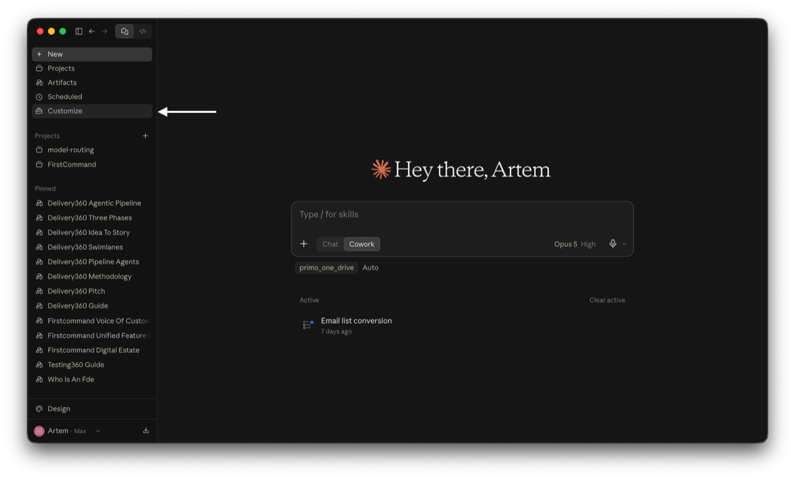
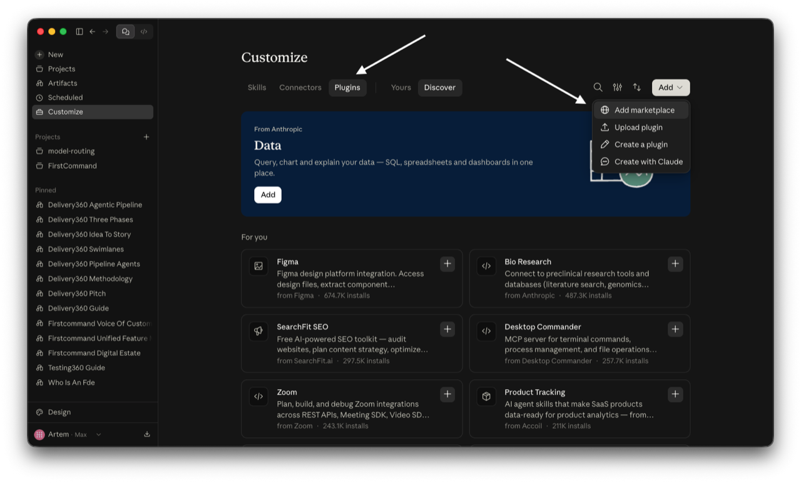
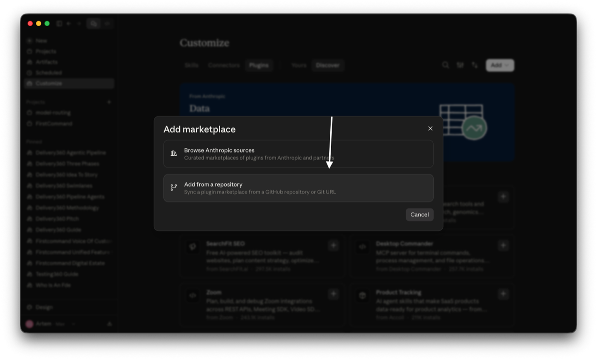
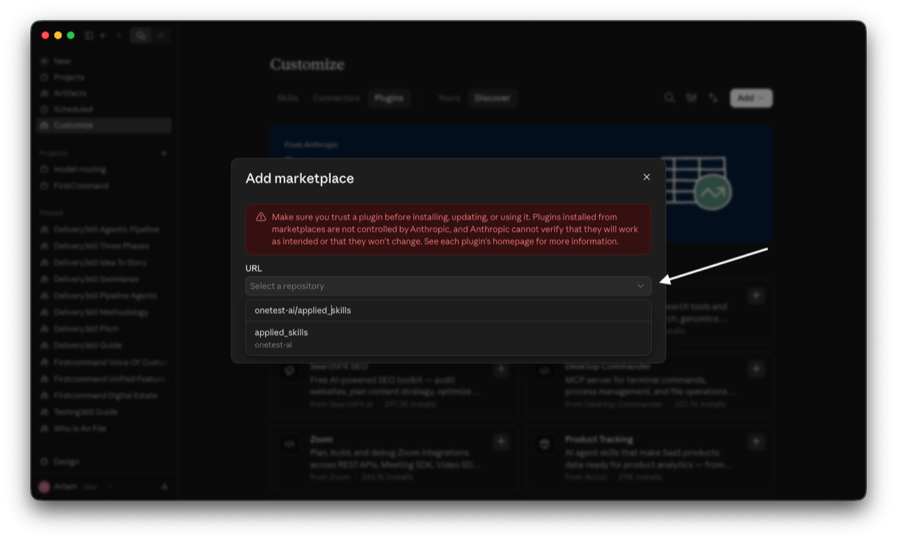
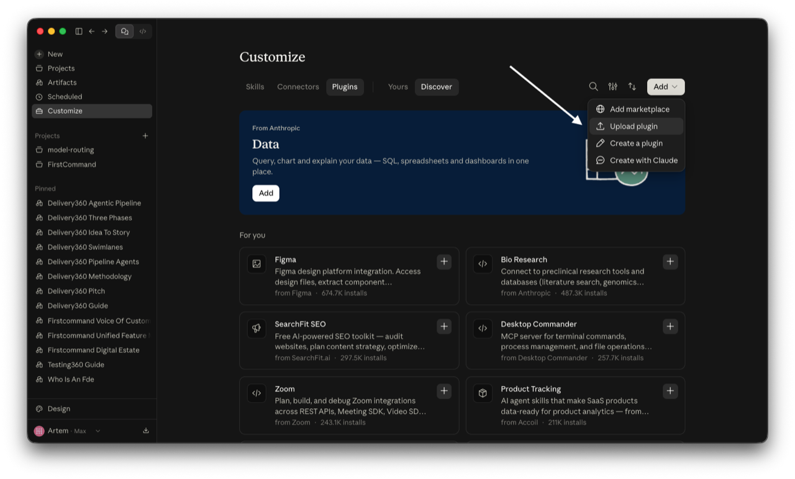
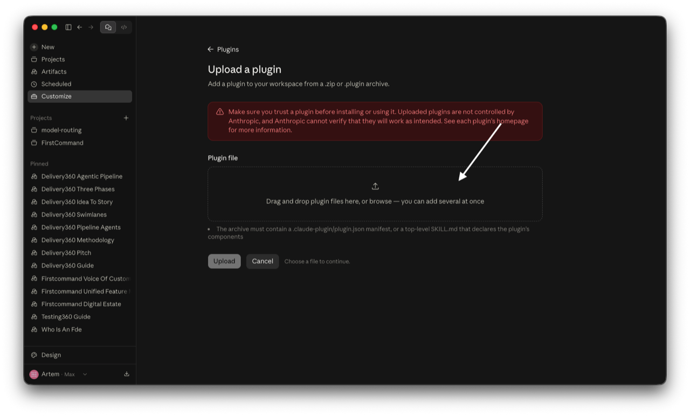
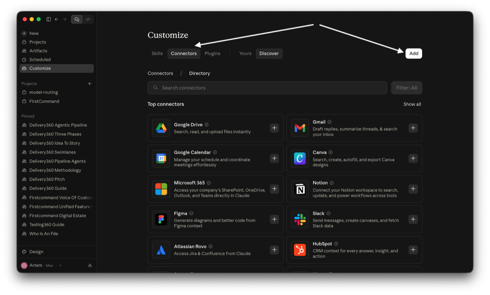
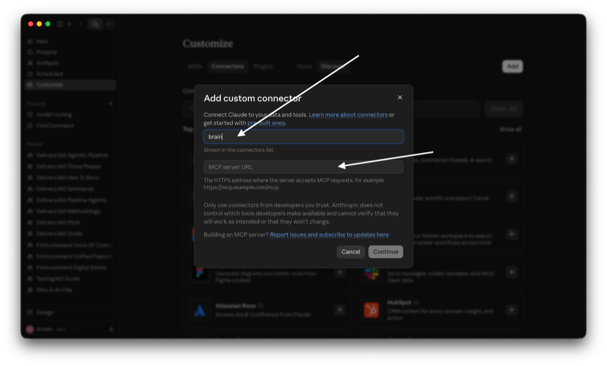

# Using kb in Claude Cowork

`kb` is the same plugin in Claude Code (CLI) and in Claude Cowork (Desktop).
Cowork keeps its own plugin install state — installing kb in the CLI does not
make it appear in Cowork — so install it in Cowork explicitly, then point it at
your project's Brain via a remote connector. Nothing runs on your machine; the
connector runs in Anthropic's cloud, so setup is identical on macOS, Windows,
and Linux.

## 1. Install the kb plugin

1. Open **Customize** from the left sidebar.

   

2. Go to the **Plugins** tab, then **Add → Add marketplace**.

   

3. Choose **Add from a repository**.

   

4. Select the `applied-ai` marketplace repository — **onetest-ai/applied_skills**.

   

5. Install **kb** from that marketplace and enable it.

> **Air-gapped alternative:** instead of a marketplace, upload a plugin ZIP of
> `bundles/kb` under **Customize → Plugins → Add → Upload plugin** (≤50 MB).
>
> 
>
> 

## 2. Add your project's Brain as a connector

Each project has its own Brain endpoint. Add it once per project:

1. Go to the **Connectors** tab and click **Add**.

   

2. In **Add custom connector**, **name the connector `brain`** and paste your
   project's **HTTPS MCP URL** (Streamable HTTP transport).

   

3. Authorize with **Entra OAuth** (Advanced settings → OAuth client id/secret).
   If your endpoint uses a static key, set an `X-API-Key` header instead.
4. Naming it `brain` matters: kb's skills call `mcp__brain__*`, so its tools are
   expected to resolve as `mcp__brain__*` when the connector is named `brain`;
   `/kb:connect`'s health probe will confirm the resolution (or reveal a
   mismatch).
5. Enable the connector.

**In two projects?** Keep each project's connector added, but two connectors
cannot both be named `brain` at once — for the current Cowork task, disable
the other project's Brain connector and enable this project's (named
`brain`), so exactly one `brain` connector is active. kb grounds itself in
that active `brain` connector.

## 3. Verify

Run `/kb:connect`. It calls `health` and reports whether the Brain is
reachable. Then use `/kb:ask`, `/kb:explore`, `/kb:challenge`, `/kb:brief`,
`/kb:report`.

## What differs from the CLI

- **Ambient mode (`/kb:mode`)** relies on a hook that does not fire in Cowork.
  In Cowork, ground answers by invoking the kb skills explicitly.
- **The SessionStart health line** reads a local store and is CLI-only.
